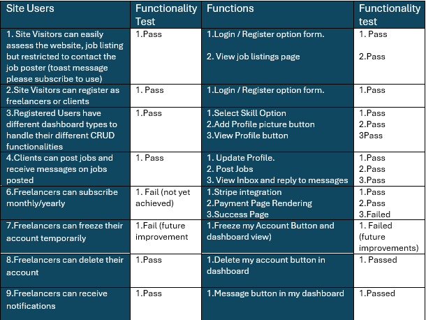
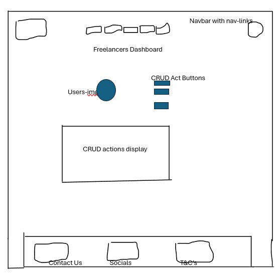
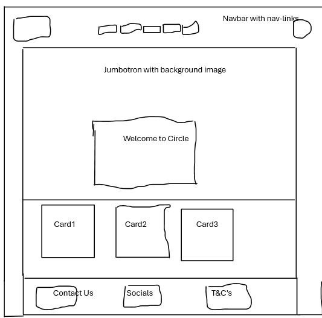
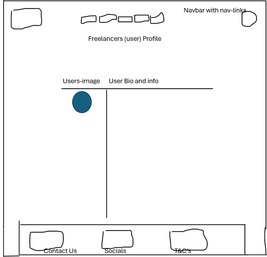
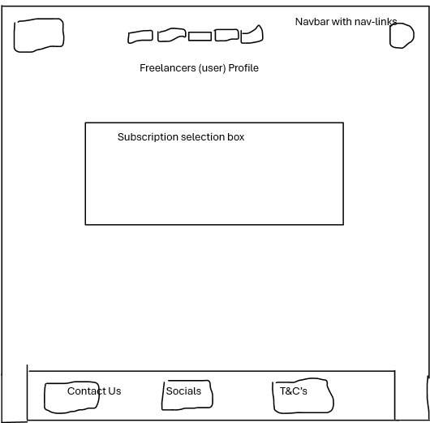
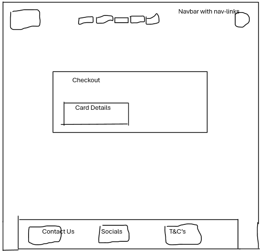
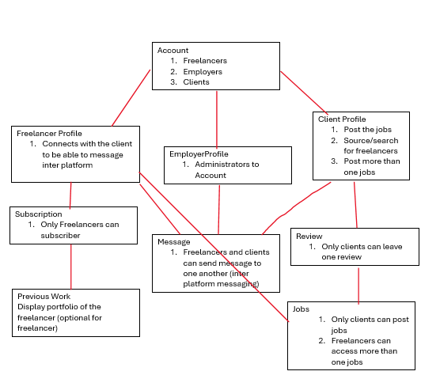
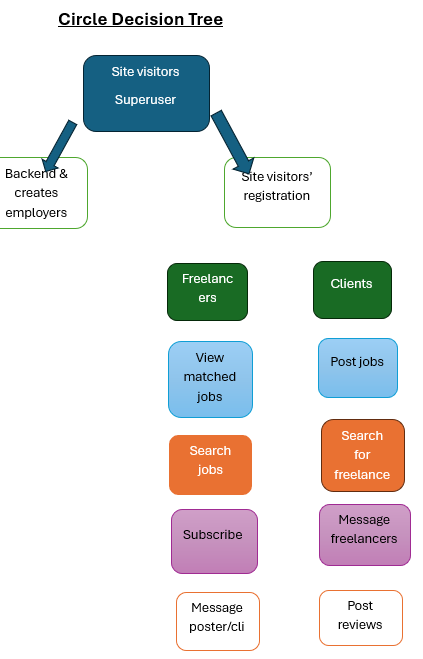

# Circle

## Table of Contents
1. [Overview](#overview)
2. [Features](#features)
3. [Technologies](#technologies) 
4. [Installation](#installation)
    -[Prerequisites](#prerequisites)
    -[Installing](#installing)
5. [Usage](#usage)
6. [Pages and Functionality](#pages-and-functionality)
7. [Manual Testing](#manual-testing)
8. [Wireframes](#wireframes)
9. [Important Points](#important-points)
    -[User Experience(UX)](#user-experience-ux)
    -[Testing](#testing)
    -[Known Bugs](#known-bugs)
10. [Tables](#tables)
10. [Descision Tree](#descision-tree)
11. [Future improvements](#future-improvements)
12. [Wireframes](#wireframes)
13. [Acknowledgements](#acknowledgements)
14. [Contact](#contact)

## Overview
Circle Project is a dynamic Django application designed to manage freelancer profiles, job postings, and subscription plans. The platform provides an all-in-one solution for connecting freelancers with potential clients, showcasing their skills, and managing job opportunities.

## Features
- **User Registration and Login**: Secure authentication with customizable user types (freelancer, client).
- **Freelancer Profile Management**: Comprehensive profiles including skills, bio, work history, and availability.
- **Job Postings and Applications**: Robust job board for posting and applying to freelance opportunities.
- **Subscription Plans**: Flexible subscription options for premium features and services.

## Technologies
- **Django**: Backend web framework
- **HTML/CSS**: Frontend structure and styling
- **Bootstrap**: Responsive design framework
- **JavaScript**: Dynamic content and interactivity
- **db.sqlite3**: Database (optional but recommended)
- **Font Awesome**: Icon library
- **Python**: Programming language

## Installation

### Prerequisites
To run this project, you will need:
- Python 3.6+
- Django 3.1+
- PostgreSQL (optional but recommended for production)
- Pip (Python package installer)

### Installing
Follow these steps to set up the project on your local machine:

1. Clone the Repository
git clone https://github.com/Nemi100/circle.git
cd circle

2. Create a Virtual Environment and Activate It
python -m venv env
source env/bin/activate  # On Windows: env\Scripts\activate

3. Install Dependencies
pip install -r requirements.txt

4. Set Up the Database
DATABASES = {
    'default': {
        'ENGINE': 'django.db.backends.sqlite3',
        'NAME': BASE_DIR / 'db.sqlite3',
    }
}
5. Apply migrations
python manage.py makemigrations
python manage.py migrate

6. Create a Superuser
python manage.py createsuperuser

7. Run the Development Server
python manage.py runserver

## Usage

## Pages and Functionality
    For proof of concept/functionality, I focused on a few pages which are Index/Home, Top Tech Wizards, Users dashboards, Users Profile, Subscription plan, and Subscription checkout.

    Home/Index Page
    The home page displays the following elements:

    1. A basic and responsive navbar with the Circle name logo to the left and, in the middle, Home, Services, About Us, Contact, Subscribe. To the far right, the account icon.

    2. A jumbotron of a computer screen and a card centered with a welcome message. The background of the card element is blurred to enhance user experience and make the card elements visible by giving it a grey card background and black text color.

    3. The card overlapping the jumbotron displays two calls to action buttons which are Get Started and View Job Listings.

    4. Below the jumbotron is a display of three cards: Top Tech Wizards Board, How It Works, Community (these cards are styled to overlap each other on smaller devices).

    5. A footer that displays Contact Us on the left, social media icons which serve as links to the social media pages in the middle, and T&Cs on the right (the footer is styled to overlap each other on smaller devices).

## Manual Testing

## Wireframes
I have approached the design of Circle with utmost simplicity, as you can see from the wireframes below:

1. Users Dashboard Wireframe:

2. Index Wireframe:

3. Freelancers Profile Wireframe:

4. Subscription Page Wireframe:

5. Checkout Wireframe:

## Important Points
1. User Experience (UX):

- Emphasis on simplicity and ease of navigation.

- Responsive design to ensure accessibility across different devices and screen sizes.

- Clear and intuitive user interfaces that reduce learning curve for new users
2. Scalability:

- Designing the system architecture to support future growth and increased user load.

- Ensuring that the application can handle additional features and functionalities without compromising performance.

## User Experience (UX)

The design philosophy of Circle revolves around simplicity and ease of use. Key aspects include:

1. Intuitive Navigation: The platform features a straightforward and user-friendly navigation system that minimizes the learning curve for new users.

2. Responsive Design: The application is designed to be fully responsive, ensuring that it works seamlessly across various devices and screen sizes.

3. Clean and Consistent Layouts: Consistent layouts and design elements are used throughout the application to provide a cohesive user experience.

4. User Feedback: Regular user feedback is incorporated into the design process to continuously improve the user experience.

## Testing

A comprehensive testing strategy is employed to ensure the robustness and reliability of the application. This includes:

1. Unit Testing: Individual components and functions are tested in isolation to ensure they work as expected.

2. Integration Testing: Interactions between different components are tested to ensure they function correctly as a whole.

3. End-to-End Testing: The entire application is tested from start to finish to simulate real user scenarios and identify any issues.

4. Manual Testing: Manual testing is conducted to catch any edge cases or issues that automated tests might miss.

5. Cross-Browser Testing: The application is tested on multiple browsers to ensure compatibility and consistent performance.

6. Performance Testing: Load testing and performance testing are conducted to ensure the application can handle high traffic and large datasets.

## Known Bugs

While every effort has been made to ensure the application is bug-free, some known issues may still exist:

1. Top Tech Wizards Board do add Clients profiles, This would be looked into .

2. Messages in the dashboard would need more refininment, I would leave for future developements

3. Stripe payments is yet to be fully functioning as it doesnt run to success . 

4. The cards displaying top tech wizards and job postinmgs are not fully responsive as some are longer the other which means when i have a list of 10 which is the maximum per page the display wld be non uniform

## Tables

- Table Relationships:

## Descision Tree

- The User Journey

## Future Improvements

The Cirle will be an Ongoing project and the following would be top of list priorities 

1. To ensure the  Tech Wizards Board do add only freelancers who have the best reviews per week or freelancers available being a growing site.

2. To remodel the Messages in the dashboard view.

3. To continually ensure freelancers subscription and Stripe payments is fully functioning . 

4. to also fix cards displaying top tech wizards and job postings to be fully responsive as some are longer the other which means when i have a list of 10 which is the maximum per page the display wld be non uniform.

## Acknowledgements

We would like to thank the following individuals and organizations for their contributions to this project:

 - [Parwiz Forogh](https://www.youtube.com/watch?v=Pu9XhFJduEw&t=2s)
 - [Awesome README](https://github.com/matiassingers/awesome-readme)
 - [TechWithGio](https://www.youtube.com/watch?v=OLsVfmjEpSc&t=95s)
 - [Pexels Images](https://www.pexels.com/search/concert/)
 - [Code Institute Boutique Ado Project](https://www.youtube.com/watch?v=Semy2AHoclk)

 - [Parwiz Forogh](https://www.youtube.com/watch?v=XTpLbBJTOM4&t=276s)

## Contact
- **For any questions, please contact**:
   Name: Tekena Nemi

- Email: teksity@gmail.com

